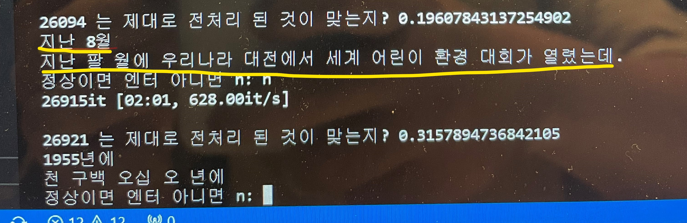
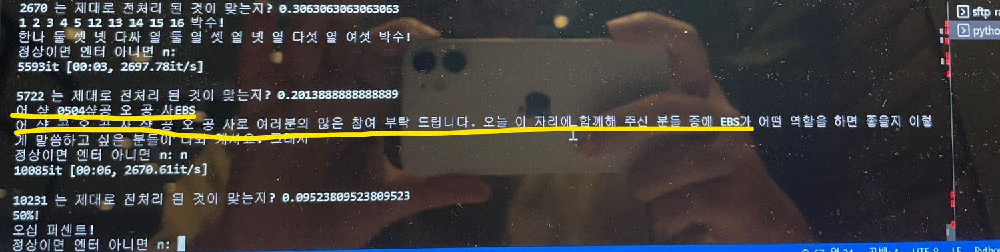

# Konuko Model ([Ko] -> [nu]m -> [ko] Model)

한국어 문장에서 숫자가 들어간 문장을 한글로 변환 해주는 모델입니다.
그 반대도 가능합니다.

숫자를 경우에 따라 읽는 방법이 달라지게 되므로 이를 딥러닝 모델을 활용해 해결하려는 토이 프로젝트입니다.

ex)
- 경제 1번지 <-> 경제 일번지
- 오늘 1시에 보는게 어때? <-> 오늘 한 시에 보는게 어때?

# 사용 데이터
- 본 repo에서는 음성 데이터의 정답 스크립트를 [KoSpeech](https://github.com/sooftware/kospeech) 라이브러리를 사용하여 trn 파일로 전처리하여 사용했습니다.
[KSponSpeech](https://aihub.or.kr/aihubdata/data/view.do?currMenu=115&topMenu=100&aihubDataSe=realm&dataSetSn=123)는 이곳에서 다운 받을 수 있습니다.
- 공개할 모델은 이외에도 [KoreanSpeech](https://aihub.or.kr/aihubdata/data/view.do?currMenu=115&topMenu=100&aihubDataSe=realm&dataSetSn=130), [KconfSpeech](https://aihub.or.kr/aihubdata/data/view.do?currMenu=115&topMenu=100&aihubDataSe=realm&dataSetSn=132), [KrespSpeech](https://aihub.or.kr/aihubdata/data/view.do?currMenu=115&topMenu=100&aihubDataSe=realm&dataSetSn=87)의 스크립트를 학습한 모델입니다.

# 데이터 처리
만약 AIHub에서 STT용 데이터를 다운받으셨다면, 총 3번의 데이터 처리가 필요합니다.
1. (raw_transcripts_preproc) 각 Raw Transcripts를 trn파일로 변경합니다.
2. (preprocess) trn파일에서 num sentence와 ko sentence을 추출합니다. (여기서 1차 csv 저장이 발생합니다. out.csv)
3. (postprocess) 추출한 데이터를 특수문자 전처리, 이상치 데이터 제거들을 처리 후 csv로 저장합니다. (여기서 2차 csv 저장이 발생합니다. post_out.csv)
## 1. raw_transcripts_preproc
### 1. Data Download
AIHub에서 데이터를 다운로드 받음 <br />
프로젝트의 /data/raw 폴더에 압축 풀어서 넣기

/data/raw/{압축해제한데이터명}/config.yaml 생성 <br />
해당 yaml을 생성하는 방법 및 소스는 없으며, 아래 설명을 따라 직접 구성하여야 함 <br />
config.yml 예시 <br />
```yml
common:
  구축기관: 솔루게이트
dir:
  train_flag_dir_dict: {True: "1.Training", False: "2.Validation"}
  parent_pattern: "[0-9].*"
  child_pattern: "**/[0-9]*"
dataset:
  domain_devset_cnt: {
    "1.방송": 1,
    "2.취미": 1,
    "3.일상안부": 1,
    "4.생활": 1,
    "5.날씨": 1,
    "6.경제": 1,
    "7.놀이": 1,
    "8.쇼핑": 1,
  }
```
> 해당 파일은 같은 구축기관은 같은 폴더구조를 활용한다는 점에서 착안하여, .trn파일을 일관되게 만들게 하기 위함 <br />

common : 일반적인 data의 특징들을 다룸 <br />
dir : 서로 다른 폴더 규칙을 정의하기 위해, 각 데이터별로 특징을 작성해줘야함. <br />
 - train_flag_dir_dict : train/valid set 구성의 폴더명 <br />
 - parent,child_pattern : 실제 메인, 서브도메인의 폴더명 정규식 <br />

dataset : dev set 등 데이터 추가 처리시 사용할 config <br />
### 2. Data Preprocess
```bash
bash shell_scripts/make_trn_for_make_script.sh
```
## 2. preprocess
```bash
python3 preprocess.py
```
## 3. (Optional) postprocess
혹여나 추가적인 전처리 잘못 (예를들면 feature, label이외의 length 3 list혹은 2보다 작은 list) 되거나 <br />
num과 ko 데이터가 길이가 다른경우 (뭔가 매칭이 잘못되거나 짤린 데이터) <br />
아마 seq2seq을 이용해 학습한다면, 불필요한 문장이 예측되어 정확도가 더 떨어질 수도 있다고 판단했습니다. <br />
### 예시


전혀 이상한 문장처럼 매칭되는 경우도 있음

결론적으로, 이런 데이터들을 처리하여 post_out.csv로 만들어줍니다. <br />
원리는 sequencematcher 유사도를 사용했고, 인간 판단의 임계치를 활용했으므로, 100% 보장은 안되지만 전체 데이터의 15%를 전수검사 했을 시 오차범위는 없었습니다.
